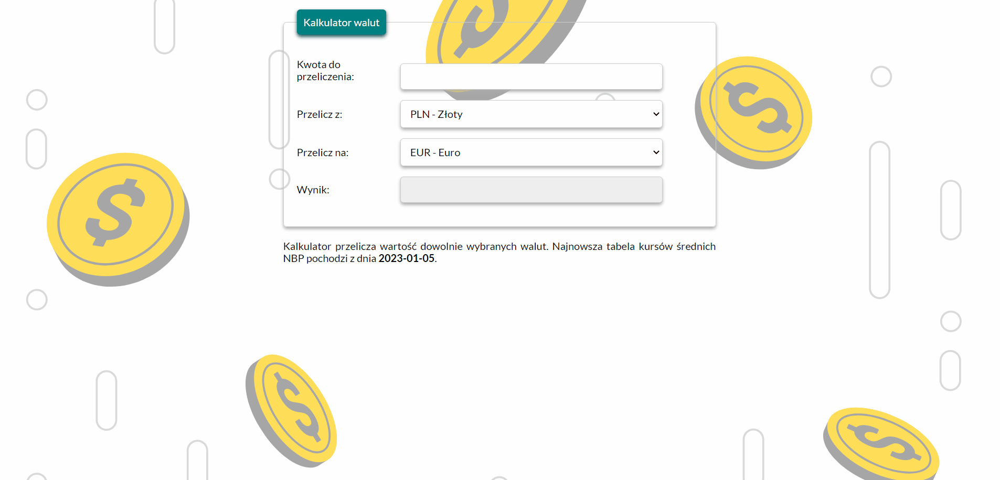

# Michał Olszewski - my website

## Demo

https://michu0808.github.io/currency-converter/currency-calculator.html

## Description

This is simple currency exchange web calculator that converts some currencies to others. So far it supports currencies such as PLN, EUR, USD, CHF and GBP. It was created with the use of my own current knowledge and skills and may be expanded in the future.

## User manual
Step 1. Enter the amount you want to convert
Step 2. Select the currency you want to convert
Step 3. Select the currency you want to convert to
The result will appear automatically :)

### Technologies used
- BEM
- CSS
- ES6+ features
- HTML
- JavaScript
